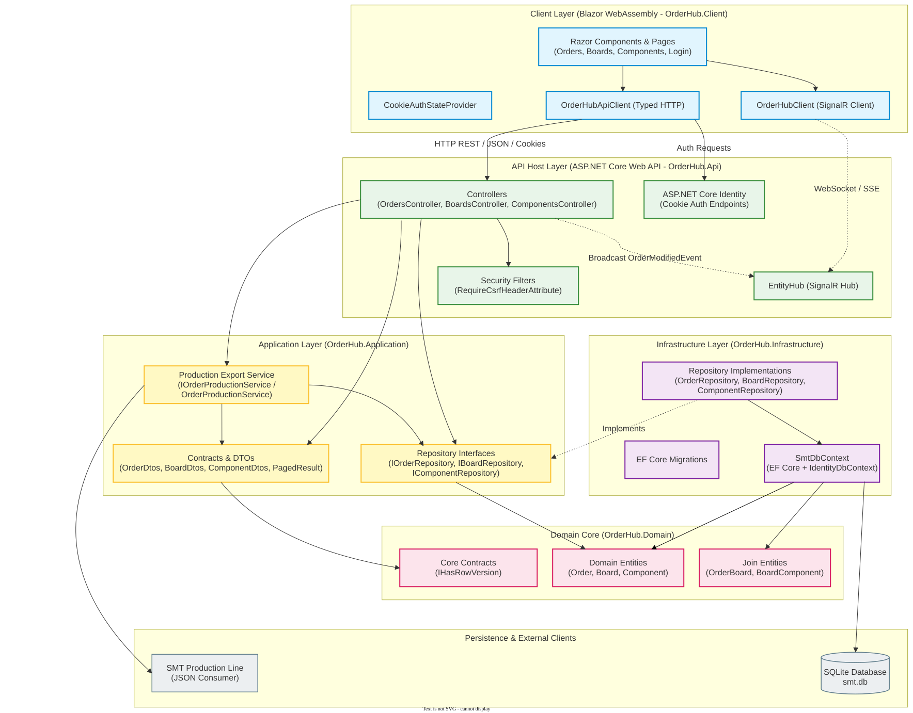
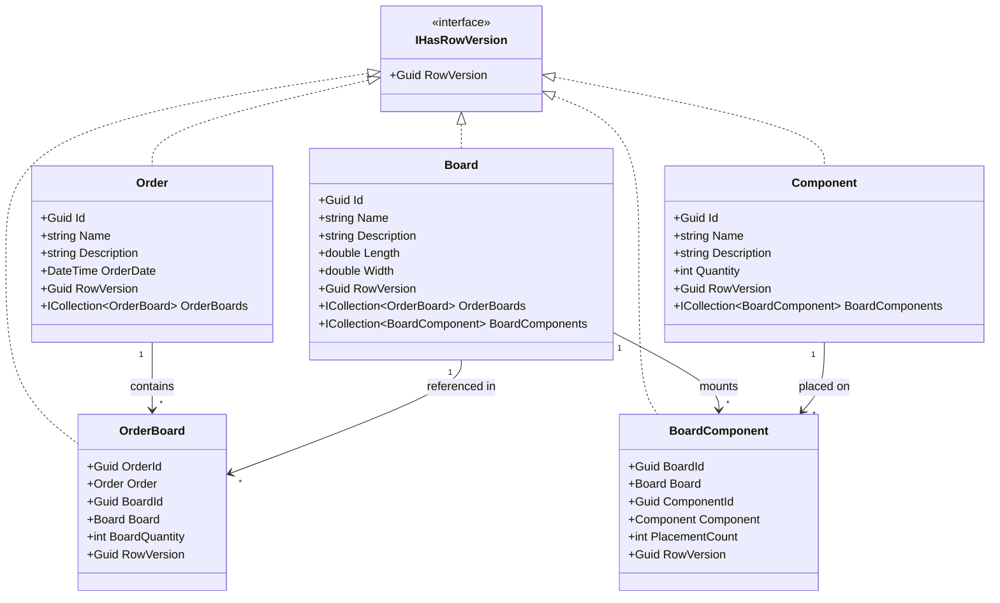
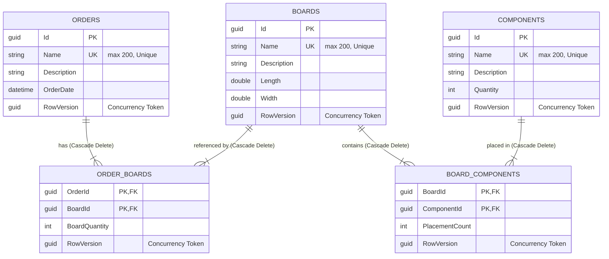
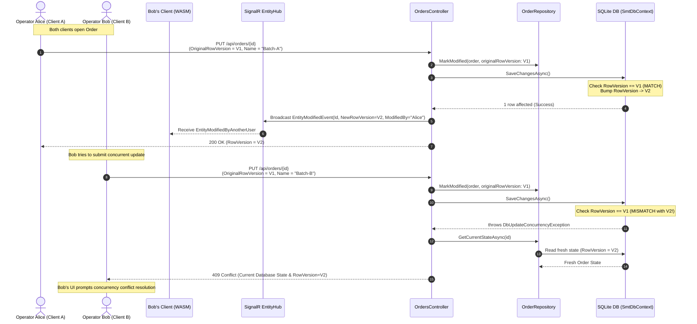

# SMT OrderHub — Architecture & Class Modeling Specification

This document provides a comprehensive structural outline of the modeled classes, contracts, interactions, and architectural patterns of the **SMT OrderHub** manufacturing system.

---

## 1. Architectural Style & Clean Architecture Layers

SMT OrderHub follows **Clean Architecture** principles and domain-centric separation of concerns across five core projects and test suites:

```text
├── src/
│   ├── OrderHub.Domain/         # Core Domain Entities, Join Entities & Contracts
│   ├── OrderHub.Application/    # DTOs, Repository Interfaces, Production Export Service
│   ├── OrderHub.Infrastructure/ # EF Core DbContext, Repositories, Migrations
│   ├── OrderHub.Api/            # ASP.NET Core Web API Controllers, SignalR Hub, Auth, CSRF
│   └── OrderHub.Client/         # Blazor WebAssembly SPA, Razor Pages & Components, State
└── tests/
    └── OrderHub.Tests/          # xUnit Integration, Concurrency & Unit Tests
```

### Layer Dependency Rules

- **Domain** has no dependencies on external frameworks or other solution projects.
- **Application** depends solely on **Domain**. It defines use-case DTOs, persistence abstractions (`IOrderRepository`, etc.), and application business services (`IOrderProductionService`).
- **Infrastructure** depends on **Domain** and implements **Application** interfaces using Entity Framework Core 10 and ASP.NET Core Identity.
- **Api** serves as the composition root, configuring DI, middleware, Serilog logging, CORS, CSRF defense, rate limiting, and SignalR real-time hubs.
- **Client** is a standalone Blazor WebAssembly frontend communicating with the API via typed HTTP client (`OrderHubApiClient`) and WebSockets (`OrderHubClient`).



---

## 2. Domain Modeling & Class Outlines

### 2.1 Core Contracts

- **`IHasRowVersion`** (`OrderHub.Domain`):
  Defines the optimistic concurrency contract:
  ```csharp
  public interface IHasRowVersion
  {
      Guid RowVersion { get; set; }
  }
  ```

### 2.2 Domain Entities

- **`Order`**:
  Represents a batch production run in SMT manufacturing.
  - `Id` (`Guid`): Primary key.
  - `Name` (`string`): Unique title identifier (e.g., `"SMT-RUN-2026-001"`).
  - `Description` (`string`): Batch details and notes.
  - `OrderDate` (`DateTime`): Timestamp stored in UTC.
  - `OrderBoards` (`ICollection<OrderBoard>`): Navigation collection to associated boards.
  - `RowVersion` (`Guid`): Concurrency token (`[ConcurrencyCheck]`).

- **`Board`**:
  Represents a printed circuit board (PCB) model design.
  - `Id` (`Guid`): Primary key.
  - `Name` (`string`): Unique board model reference (e.g., `"MCU-Mainboard-v2"`).
  - `Description` (`string`): Electrical & mechanical specifications.
  - `Length` (`double`): Dimension in millimeters.
  - `Width` (`double`): Dimension in millimeters.
  - `OrderBoards` (`ICollection<OrderBoard>`): Orders that include this board.
  - `BoardComponents` (`ICollection<BoardComponent>`): Components placed onto this board.
  - `RowVersion` (`Guid`): Concurrency token (`[ConcurrencyCheck]`).

- **`Component`**:
  Represents an electronic SMD component reel / stock item.
  - `Id` (`Guid`): Primary key.
  - `Name` (`string`): Unique part identifier (e.g., `"Resistor 10k 0805"`).
  - `Description` (`string`): Package specifications or manufacturer SKU.
  - `Quantity` (`int`): Stock count / reel availability.
  - `BoardComponents` (`ICollection<BoardComponent>`): Boards where this component is placed.
  - `RowVersion` (`Guid`): Concurrency token (`[ConcurrencyCheck]`).

### 2.3 Explicit Join Entities (Extended Attributes)

- **`OrderBoard`**:
  Many-to-many join between `Order` and `Board`.
  - Composite Key: `(OrderId, BoardId)`.
  - `BoardQuantity` (`int`): Quantity of boards produced within this specific order.
  - `RowVersion` (`Guid`): Concurrency token ensuring concurrent edits to quantities trigger optimistic concurrency checks.
  - Navigation properties: `Order`, `Board`.

- **`BoardComponent`**:
  Many-to-many join between `Board` and `Component`.
  - Composite Key: `(BoardId, ComponentId)`.
  - `PlacementCount` (`int`): Number of component instances placed on a single unit of this board.
  - `RowVersion` (`Guid`): Concurrency token.
  - Navigation properties: `Board`, `Component`.



---

## 3. Database Schema & Persistence Mapping

Persistence is handled by EF Core in `SmtDbContext`, inheriting from `IdentityDbContext` to combine business models with ASP.NET Core Identity authentication tables in a unified database schema.

### Relational Schema Key Highlights:

1. **Primary & Alternate Keys:**
   - Single-field GUID primary keys for `Orders`, `Boards`, and `Components`.
   - Composite primary keys `(OrderId, BoardId)` on `OrderBoards` and `(BoardId, ComponentId)` on `BoardComponents`.
   - Unique constraints on `Orders.Name`, `Boards.Name`, and `Components.Name`.
2. **Cascade Deletes:**
   - Deleting an `Order` cascades and removes its `OrderBoard` links without affecting `Board` entities.
   - Deleting a `Board` cascades and removes its `OrderBoard` and `BoardComponent` relations without deleting parent `Orders` or child `Components`.
3. **Optimistic Concurrency (RowVersion):**
   - Configured via `entity.Property(e => e.RowVersion).IsConcurrencyToken()`.
   - `SmtDbContext` overrides `SaveChangesAsync()` and `SaveChanges()` to automatically execute `BumpRowVersions()`, assigning a fresh `Guid.NewGuid()` to all modified entities.



---

## 4. Application Layer & Repository Design

Instead of generic anti-pattern repositories, the application provides **intention-revealing interfaces**:

### 4.1 Persistence Interfaces

- **`IOrderRepository`**:
  - `GetByIdAsync(Guid id, CancellationToken ct)`
  - `GetDetailByIdAsync(Guid id, CancellationToken ct)` (eager loads `OrderBoards`, `Board`, `BoardComponents`, `Component`)
  - `SearchAsync(string? searchTerm, int page, int pageSize, CancellationToken ct)`
  - `AddAsync(Order order, CancellationToken ct)`
  - `DeleteAsync(Order order, CancellationToken ct)`
  - `MarkModified(Order order, Guid originalRowVersion)` (configures EF Change Tracker for concurrency verification)
  - `GetCurrentStateAsync(Guid id, CancellationToken ct)` (retrieves non-tracking snapshot for 409 Conflict payloads)
- **`IBoardRepository`**:
  - Similar pattern with `GetDetailByIdAsync` fetching board components and placement counts.
- **`IComponentRepository`**:
  - Manages component catalog and stock level updates.

### 4.2 Data Transfer Objects (DTOs)

The API boundary is strictly separated from domain entities using immutable record DTOs:

- **Order DTOs:** `OrderDto`, `OrderDetailDto`, `BoardAssignmentDto`, `CreateOrderRequest`, `UpdateOrderRequest`, `BoardAssignmentRequest`.
- **Board DTOs:** `BoardDto`, `BoardDetailDto`, `PlacementDto`, `CreateBoardRequest`, `UpdateBoardRequest`, `PlacementRequest`.
- **Component DTOs:** `ComponentDto`, `CreateComponentRequest`, `UpdateComponentRequest`.
- **Pagination:** `PagedResult<T>` (`Items`, `TotalCount`, `Page`, `PageSize`, `TotalPages`).

### 4.3 SMT Production Export Service

- **Interface:** `IOrderProductionService`
- **Implementation:** `OrderProductionService`
  - Retrieves the full aggregate graph using `_orderRepository.GetDetailByIdAsync(orderId)`.
  - Validates that the order exists and contains at least one assigned board.
  - Transforms the domain graph into a hierarchical **`ProductionOrderPayload`**:
    - `ProductionBoard` (Name, Length, Width, Quantity, Placements)
    - `ProductionPlacement` (Component Name, Description, PlacementCount)
  - Serializes to camelCase, indented JSON via `System.Text.Json` with `ReferenceHandler.IgnoreCycles`.
  - Records an audit log event with Serilog detailing board count, total placements, and payload byte size.

---

## 5. Concurrency Control & Real-Time Sync Architecture

In an industrial SMT plant, multiple operators or production managers may view or edit identical orders and batch settings simultaneously. SMT OrderHub implements a two-tier strategy:

1. **Optimistic Concurrency Control (Data Integrity):**
   - Each entity maintains a `RowVersion` GUID.
   - When updating, clients transmit `OriginalRowVersion`.
   - The repository registers the original token:
     ```csharp
     _context.Entry(order).Property(o => o.RowVersion).OriginalValue = originalRowVersion;
     ```
   - On conflict, EF Core throws a `DbUpdateConcurrencyException`.
   - The API catches this exception, loads the current database record via `GetCurrentStateAsync(id)`, and responds with **`HTTP 409 Conflict`** including the fresh entity state.

2. **Real-Time Event Propagation (Proactive Notification):**
   - Upon successful database commits, API controllers broadcast a unified `EntityModifiedEvent` (id, new RowVersion, modified-by user, timestamp) through SignalR (`IHubContext<EntityHub>`).
   - Clients subscribe per entity (`WatchOrder` / `WatchBoard` / `WatchComponent` on the `/hubs/orders` hub) while editing; connected Blazor WASM clients receive notifications in real-time and can open a side-by-side conflict review before attempting an outdated save.



---

## 6. Client Architecture (Blazor WebAssembly)

The Blazor WebAssembly frontend (`OrderHub.Client`) is designed around component reusability, asynchronous state management, and enterprise security:

### 6.1 Authentication & Security Handling

- **`CookieAuthStateProvider`**: Inherits `AuthenticationStateProvider`, querying `/api/auth/manage/info` to maintain user claims and login state.
- **`BrowserCredentialsHandler`**: Configured on `HttpClient` to ensure browser cookies (`OrderHub.Auth`) are attached to cross-origin requests (`Include` mode).
- **`RequireCsrfHeaderAttribute` Support**: The client injects the `X-Requested-With: OrderHub` header on all HTTP requests to prevent unauthorized cross-site requests.

### 6.2 Key UI Components & State

- **List Pages (`Orders.razor`, `Boards.razor`, `Components.razor`)**:
  - Server-side debounced search (`System.Timers.Timer`) with explicit UI re-rendering.
  - Reusable `Pager.razor` integrating `PagedResult<T>`.
- **Assignment Editors (`AssignmentList.razor`, `AssignmentRow.cs`)**:
  - Reusable pick-list component managing many-to-many child assignments (Orders $\leftrightarrow$ Boards and Boards $\leftrightarrow$ Components).
  - Supports `RowHrefFactory` for direct row navigation.
- **Localization**:
  - Multi-language support (English + easter-egg culture) via `SharedResource.resx` and `CultureSelector.razor` (culture persisted in `localStorage`, applied at WASM startup).
